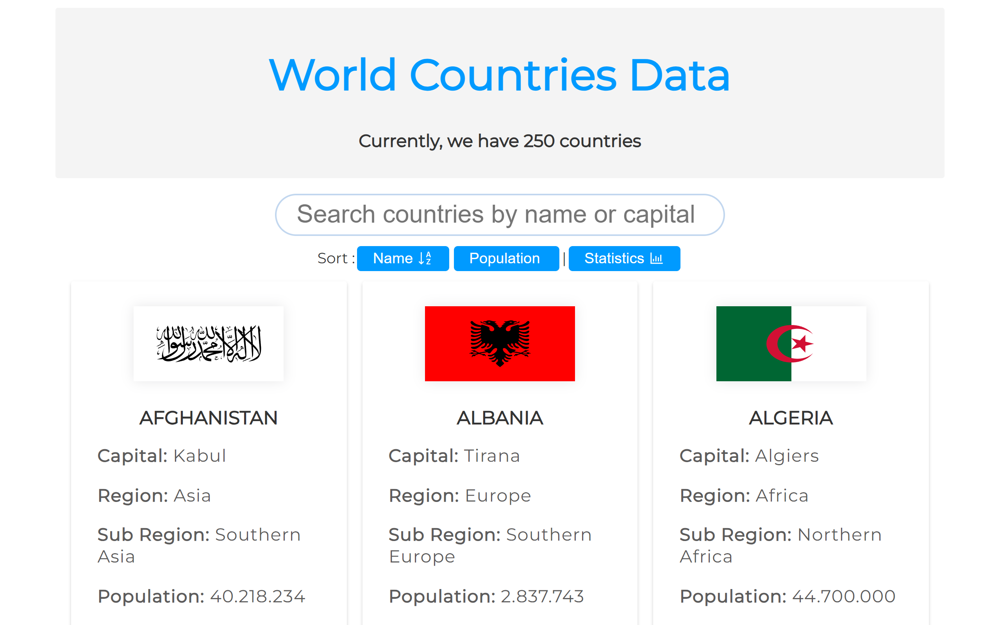
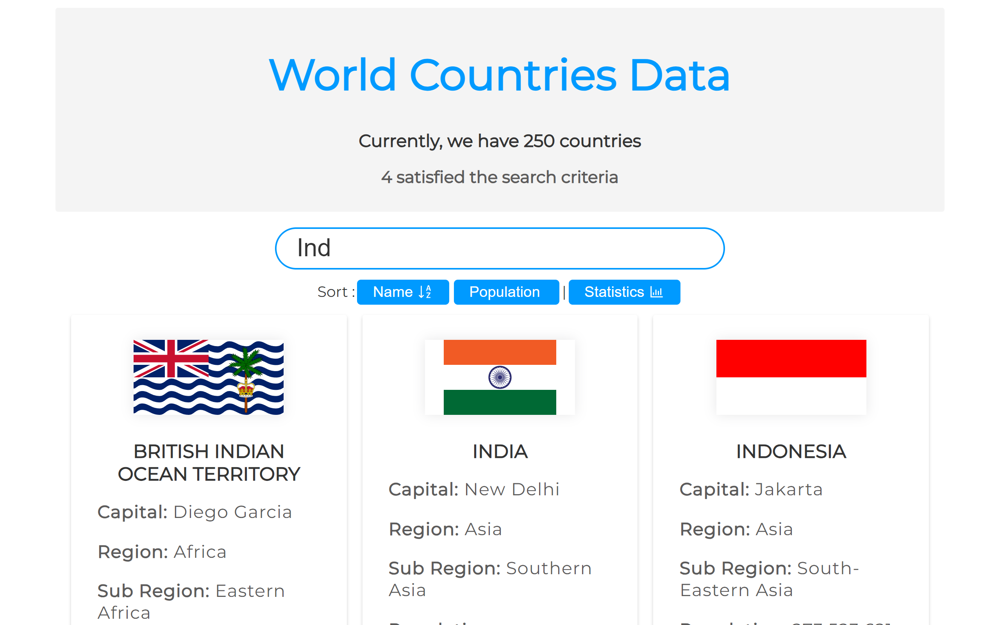
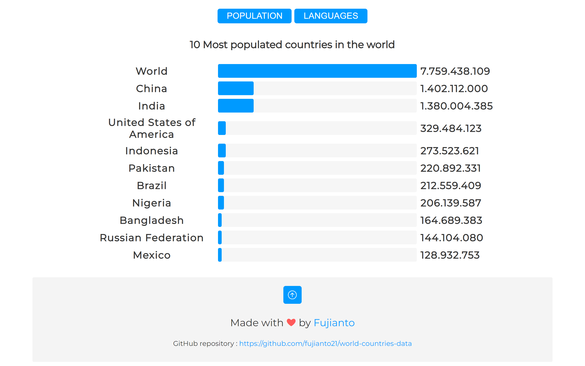

# World Countries Data
A simple application to display country data from an API, built with React.js.

## Technologies
The following technologies are used to develop this application:
1. React.js
2. Countries API by https://restcountries.com/v2/all

## Requirement
- **NodeJS** version **14.0.0** or higher

## Installation
1. Download or clone this repo : `git clone https://github.com/fujianto21/world-countries-data.git`
2. Enter the project directory
3. Install the dependencies : `npm install`
4. Run the project : `npm run start`
5. The app should now be running locally. Open your web browser and navigate to `http://localhost:3000` to view the app.

## Screenshots
1. Initial Display
   
  
2. Display when searching for country data by name or capital
   
   
3. Display of statistical data based on the ten most populated countries and the ten most spoken languages
   

## Live Demo
https://app.fujianto21.com/world-countries-data
